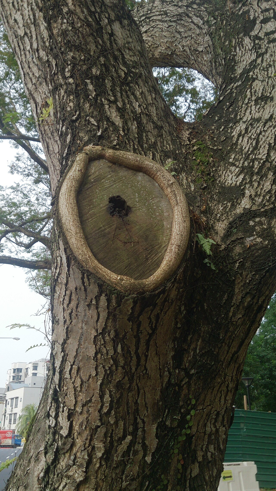

# 01 — Grundprinzipien: Wie du einen Baum klein hältst

## Wie ein Baum auf Schnitt reagiert

Bevor du schneidest, musst du zwei Mechanismen verstehen:

### 1. Apikaldominanz
Die oberste Knospe eines Triebs (die „Spitzenknospe") produziert Hormone (Auxine), die die darunterliegenden Knospen unterdrücken. Schneidest du die Spitze ab, fällt die Unterdrückung weg — **mehrere** Knospen darunter treiben aus. Deshalb reagieren gekappte Bäume „besenartig" mit vielen steilen Trieben.

**Konsequenz:** Wer einfach oben kappt, bekommt mehr und schnelleres Wachstum, nicht weniger. Die Lösung heißt **Ableiten** (siehe unten).

### 2. Winterschnitt treibt, Sommerschnitt bremst
- **Winter (Saftruhe):** Der Baum hat seine gesamte Energie in Wurzeln und Stamm gespeichert. Schneidest du jetzt, verteilt sich diese Energie im Frühjahr auf weniger Knospen → **starker Austrieb**. Gut für Aufbau und Verjüngung, schlecht fürs Kleinhalten.
- **Sommer (Juni–August):** Die Energie steckt in den Blättern. Schneidest du jetzt, nimmst du dem Baum Energie weg → **gebremstes Wachstum**, kleinere Reaktion, schnellere Wundheilung.

**Konsequenz:** Die 4-Meter-Pflege findet hauptsächlich im Sommer statt. Genau so machen es auch die japanischen Gärtner: Sie „lesen" ihre Niwaki ein- bis zweimal jährlich im Sommer und schneiden nach.

## Die Königstechnik: Ableiten

**Ableiten** heißt: Einen zu lang oder zu hoch gewordenen Ast nicht irgendwo kappen, sondern bis zu einem **schwächeren Seitenast** zurückschneiden, der in die gewünschte Richtung zeigt — meist nach außen oder waagerecht. Dieser Seitenast übernimmt die Führung.

Regeln fürs Ableiten:
- Der übernehmende Seitenast sollte **mindestens ⅓ so dick** sein wie der entfernte Teil (sonst reagiert der Baum mit Notaustrieben).
- Schnitt **knapp über der Abzweigung**, leicht schräg, ohne den Seitenast zu verletzen.
- Immer auf **nach außen** zeigende Äste ableiten → die Krone wird breit und flach statt hoch und dicht.

So bleibt der Baum bei 4 m, sieht aber aus, als wäre er natürlich so gewachsen. Das ist der ganze Trick — in Japan wie hier.

## Schnittführung im Detail

<figure class="img-right">
  
  <figcaption>So sieht Erfolg aus: Eine am Astring gesetzte Wunde überwallt ringförmig von außen nach innen.</figcaption>
</figure>

- **Ganze Äste entfernen:** Auf **Astring** schneiden — das ist die kleine Wulst am Astansatz. Nicht bündig am Stamm schneiden und keinen Stummel stehen lassen. Der Astring enthält das Gewebe, das die Wunde verschließt (siehe Foto).
- **Dicke Äste (> 5 cm):** Mit **Entlastungsschnitt** arbeiten: erst von unten ansägen, dann von oben weiter außen durchsägen, zuletzt den Stummel sauber am Astring nachschneiden. Sonst reißt die Rinde ein.
- **Faustregel Wundgröße:** Wunden über 5–8 cm Durchmesser heilen bei Kirsche und Ahorn schlecht. Lieber jedes Jahr viele kleine Schnitte als alle fünf Jahre einen großen — auch das ist die japanische Philosophie.
- **Wundverschlussmittel:** Nach heutigem Stand meist unnötig bis kontraproduktiv. Sauberer Schnitt zur richtigen Zeit ist der beste Wundschutz.

## Werkzeug

| Werkzeug | Wofür | Hinweis |
|---|---|---|
| Bypass-Schere (z. B. Felco, ARS, Okatsune) | Triebe bis ~2 cm | Okatsune 103/104 ist der japanische Klassiker |
| Bypass-Astschere | Äste 2–4 cm | Keine Amboss-Schere für lebendes Holz (quetscht) |
| Handsäge mit Zugschnitt (japanisch: z. B. Silky, ARS) | Äste ab 3 cm | Japanische Sägen schneiden auf Zug — sauberer Schnitt |
| Teleskop-Astsäge oder kleine Leiter | Arbeiten in 3–4 m Höhe | Bei 4-m-Bäumen reicht oft eine Dreibeinleiter (japanisch: *sankyaku*) |
| Desinfektion (Spiritus) | Zwischen kranken Bäumen | Besonders wichtig bei Kirsche (Pilzkrankheiten) |

**Scharf ist Pflicht.** Quetschende, stumpfe Schnitte sind Eintrittspforten für Pilze — bei Kirsche und Ahorn der Hauptgrund für Misserfolge.

**Sicherheit in der Höhe.** Schon 3–4 m sind genug für ernste Stürze. Die Leiter auf festen, ebenen Grund stellen, nie auf den obersten Sprossen stehen, nie mit der Stichsäge über Schulterhöhe hantieren und nicht allein bei größeren Eingriffen arbeiten. Was du nur mit Motorsäge oder freihändig kletternd erreichst, gehört in die Hände einer Fachfirma — kein Baum ist einen Krankenhausbesuch wert.

## Die 4-Meter-Strategie in drei Phasen

### Phase 1 — Aufbau (Jahr 1–2): Gerüst festlegen
- Stammhöhe wählen: z. B. 1,8–2,2 m astfreier Stamm, darüber die Krone.
- **3–5 Leitäste** auswählen, die möglichst waagerecht und gleichmäßig verteilt stehen. Alles andere am Stamm entfernen.
- Konkurrenztriebe zur Spitze („Zwiesel") konsequent rausnehmen — oder die Spitze gleich auf einen waagerechten Ast ableiten. So bekommt der Baum von Anfang an eine flache, schirmartige Statur.

### Phase 2 — Deckel drauf (sobald ~4 m erreicht)
- Den Mitteltrieb auf einen kräftigen, flach stehenden Seitenast **ableiten** — das ist der „Deckel". Nicht kappen!
- Ab jetzt darf kein Trieb mehr dauerhaft über die 4-m-Linie: Was drüber wächst, leitest du jeden Sommer auf einen tieferen Seitentrieb ab.

### Phase 3 — Erhalt (jedes Jahr, dauerhaft)
Jährlicher Sommer-Durchgang, pro Baum meist 20–40 Minuten:
1. **Steiltriebe und Wasserschosser** komplett entfernen — am Ansatz ausreißen, solange grün, oder sauber abschneiden.
2. **Nach innen wachsende, kreuzende, reibende Triebe** raus.
3. Höhe kontrollieren: Übersteher **ableiten**.
4. Etagen freistellen: Zwischen den Astetagen Luft lassen, damit das Blätterdach als „Wolken" oder „Schirm" lesbar bleibt (→ [Kapitel 02](02_japanische_schnittkunst.md)).

## Sonderfall: Der Baum ist schon zu hoch

Die drei Phasen oben beschreiben den Aufbau eines jungen Baums. Häufiger steht der Baum aber schon und ist längst über 4 m. Dann gilt: **nicht in einem Jahr herunterzwingen**, sondern über 2–3 Jahre absenken.

1. **Pro Jahr höchstens ein Viertel bis ein Drittel der Höhe wegnehmen.** Ein 7-m-Baum wird also nicht in einem Sommer auf 4 m gestutzt, sondern erst auf ~5,5 m, im Folgejahr auf ~4,5 m, dann auf das Zielmaß. Wer mehr auf einmal nimmt, erntet einen Wald aus Wasserschossern.
2. **Auch hier wird abgeleitet, nicht gekappt.** Den zu hohen Mitteltrieb und die Übersteher jeweils auf einen tiefer sitzenden, möglichst waagerechten Seitenast zurücknehmen (siehe „Ableiten" oben). Der Seitenast übernimmt und bildet den neuen, flacheren Wipfel.
3. **Zum richtigen Zeitpunkt** der jeweiligen Art (→ Kapitel [03](03_wildkirsche.md)–[06](06_weissdorn.md)) — gerade beim Absenken fallen größere Wunden an, also bei Kirsche und Ahorn unbedingt im Sommer bzw. Spätsommer.
4. **Wundgröße im Blick behalten:** Lässt sich das Ziel nur über einen Schnitt > 5–8 cm erreichen, lieber ein Jahr mehr einplanen und in zwei kleineren Schritten ableiten.

Nach dem Absenken bist du in Phase 3 (Erhalt) — ab dann hält der jährliche Sommerdurchgang die Höhe.

## Was du NICHT tun solltest

- ❌ **Kappen** (alle Äste auf gleicher Höhe absägen): erzeugt Besenwuchs, Fäulnis, Dauerbaustelle.
- ❌ **Alles auf einmal:** Nie mehr als ~20–25 % der Blattmasse in einem Jahr entfernen (Ausnahme: Hasel verträgt mehr).
- ❌ **Bei über 30 °C oder in der Mittagssonne** große Eingriffe — frisch freigestellte Rinde bekommt Sonnenbrand.
- ❌ **Kirsche im Winter schneiden** (→ [Kapitel 03](03_wildkirsche.md)).
