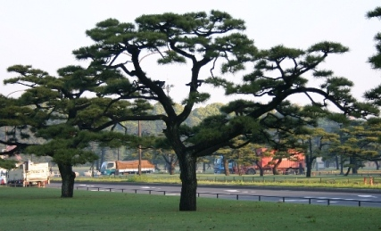
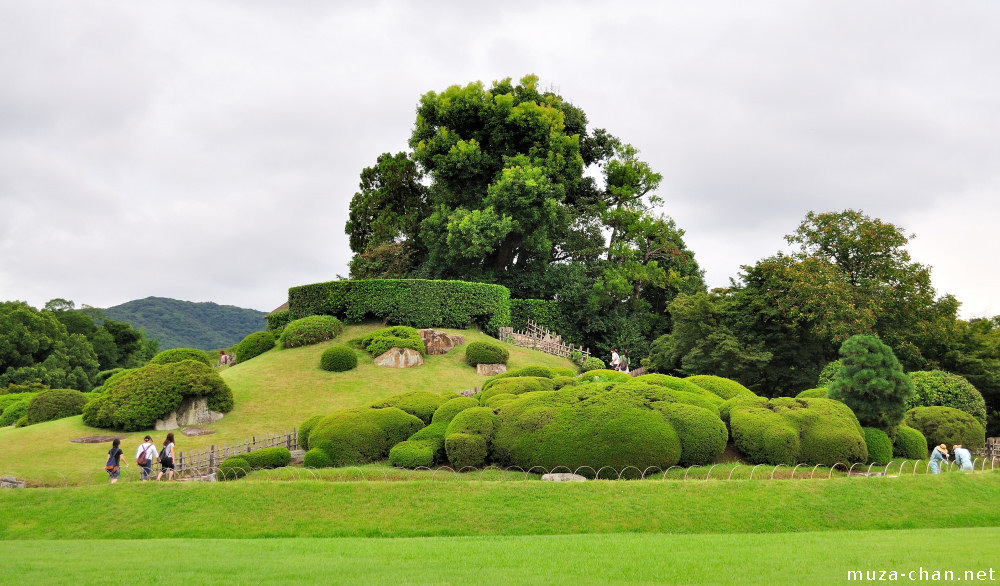
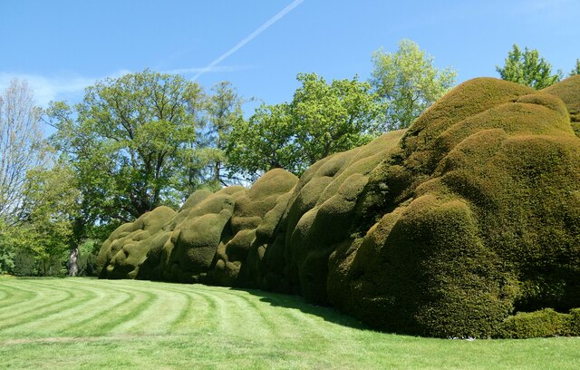
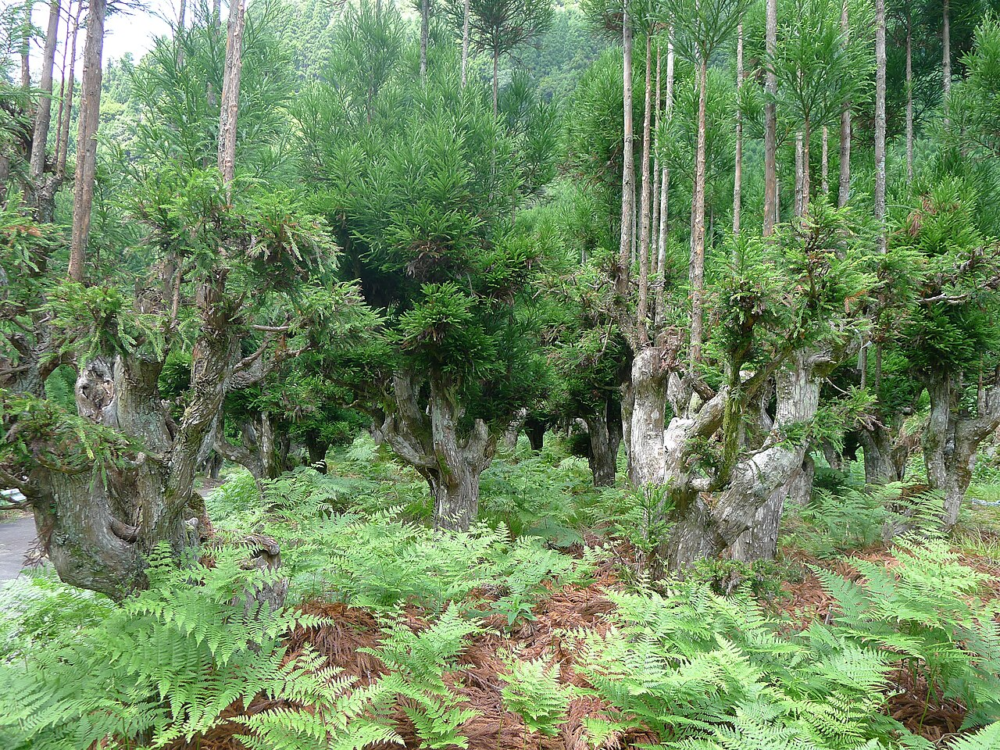

# 2 Japanische Schnittkunst: Niwaki (庭木)

## Was ist Niwaki?

**Niwaki** heißt wörtlich einfach „Gartenbaum" — gemeint ist aber ein Baum, den Gärtner über Jahre durch Schnitt und Formung zu einer idealisierten, oft jahrhundertealt wirkenden Gestalt erzogen haben. Niwaki ist gewissermaßen **Bonsai in Gartengröße**: dieselbe Ästhetik, aber am ausgepflanzten Baum.

<figure class="img-right">
  
  <figcaption>Schwarzkiefern in Tokio: klar getrennte, waagerechte Astetagen — und keine wird je höher als gewollt.</figcaption>
</figure>

Die für unser 4-Meter-Ziel entscheidende Erkenntnis: **In Japan hält man Bäume, die 25 m hoch werden könnten, ganz selbstverständlich dauerhaft auf 3–5 m** — und sie sehen dabei schöner aus als ihre wilden Brüder. Das ist keine Verstümmelung, sondern eine eigene Kunstform mit klaren Regeln.

## Die Niwaki-Ästhetik: Was macht das schöne Blätterdach aus?

Japanische Gärtner formen nicht „einen runden Busch", sondern arbeiten mit diesen Elementen:

### 1. Lesbarer Stamm und Astgerüst (幹 miki, 枝 eda)
Stamm und Hauptäste sollen **sichtbar** sein. Das Laub sitzt nicht als geschlossener Klumpen auf dem Baum, sondern in **getrennten Polstern an den Astenden**. Dazwischen: Luft. Das ist der größte Unterschied zum europäischen Heckenbusch-Denken.

### 2. Etagen und Wolken
- **Dan-zukuri (段作り, Etagenform):** Die Äste wachsen in klar getrennten horizontalen Ebenen („Etagen"). Klassisch bei Kiefern, funktioniert aber genauso bei Laubbäumen.
- **Tamamono / Tama-zukuri (玉物, Kugel-/Wolkenform):** Die Laubpolster an den Astenden werden zu weichen, kissenartigen „Wolken" geschnitten. Im Westen heißt das oft „Cloud Pruning".
- Für ein **Blätterdach** kombinierst du beides: wenige waagerechte Etagen, deren oberste sich zu einem flachen Schirm schließt.

<figure class="img-left">
  
  <figcaption>Karikomi im Korakuen-Garten (Okayama): Sträucher als weiche, fließende Wolkenlandschaft.</figcaption>
</figure>

<figure class="img-right">
  
  <figcaption>Die Technik funktioniert auch in Europa: wolkengeschnittene Eiben in Doddington Place, England.</figcaption>
</figure>

### 3. Asymmetrie und ungerade Zahlen
Japanische Gestaltung meidet Symmetrie. 3 oder 5 Leitäste, unterschiedlich lang, die Krone leicht einseitig — das wirkt natürlich gewachsen. Perfekt gleichmäßige Bäume wirken tot.

### 4. Der „gealterte" Look
Ziel ist die Anmutung eines alten, vom Wetter geformten Baums: **waagerechte bis leicht hängende Äste**. Junge Bäume wachsen steil, erst alte Äste senken sich. Deshalb binden japanische Gärtner Äste aktiv herunter oder beschweren sie mit Bambusstangen, bis sie die flache Position verholzt haben (1–3 Jahre).

## Die wichtigsten Techniken im Werkzeugkasten

### Mekiri / Midoritsumi — Pinzieren der Neutriebe
Im Frühsommer kürzt du weiche, noch nicht verholzte Neutriebe mit den Fingern oder der Schere auf wenige Blätter ein. **Das ist die Hauptmethode, mit der Niwaki klein bleiben:** Du lässt das Holz gar nicht erst entstehen, das du später absägen müsstest. Bei Laubbäumen heißt das: Neutriebe im Juni auf 2–4 Blätter zurücknehmen.

### Eda-nuki (枝抜き) — Auslichten ganzer Äste
Statt vieler kleiner Schnitte entfernst du einen kompletten Ast am Ansatz, wenn er das Bild stört — zu steil, kreuzend, zu dicht. „Ein guter Schnitt ersetzt zwanzig schlechte."

### Fukashi — Laubpolster modellieren
Die „Wolken" an den Astenden putzt du von **unten und innen** sauber aus (alle nach unten und innen wachsenden Triebe raus), oben schneidest du nur leicht in Form. So entstehen die typischen Polster: oben weich gerundet, unten scharf abgegrenzt.

### Hasami-zukuri vs. Tezumi — Schere vs. Hand
Feine Laubbäume (besonders Ahorn!) zupfen japanische Gärtner möglichst **per Hand** oder schneiden Trieb für Trieb mit der spitzen Schere — nie rasieren sie sie mit der Heckenschere. Die Heckenschere durchtrennt Blätter → braune Ränder, struppiges Bild.

### Shitate / Yoseue — Formieren mit Bambus und Schnur
Äste werden mit Bambusstangen, Schnüren (traditionell schwarz gefärbtes *shuro-nawa*-Palmseil) und Gewichten in die Waagerechte gezogen. Wichtig:
- Breite, weiche Anbindung (Schlauchstück unterlegen), **nie** Draht direkt auf Rinde.
- Jährlich kontrollieren und lockern — Einwachsen ist die häufigste Anfängerwunde.
- Junge, biegsame Äste formen; dicke Äste lassen sich nicht mehr umerziehen, nur ersetzen.

### Daisugi & Kopfschnitt-Tradition

<figure class="img-left">
  
  <figcaption>Daisugi bei Kyōto: Auf jahrhundertealten Sockeln wachsen kerzengerade Stämme nach — immer wieder.</figcaption>
</figure>

Japan kennt auch radikale Formen wie **Daisugi**: Zedern werden wie Kopfweiden bewirtschaftet, auf dem „Sockel" wachsen kerzengerade Stämme nach. Für uns ist das der Beleg: **Regelmäßiger Rückschnitt auf denselben Punkt ist über Jahrzehnte baumverträglich**, wenn man ihn konsequent jährlich macht. Daraus leitet sich die Pflege des Hasels und des Weißdorns ab.

## Niwaki-Pflegekalender (Laubbäume)

| Zeitpunkt | Maßnahme |
|---|---|
| **Juni** | Haupt-Formschnitt: Pinzieren der Neutriebe, Wolken modellieren, Übersteher ableiten |
| **August/September** | Zweiter, leichter Durchgang: Nachtriebe korrigieren, Feinform |
| **Spätwinter (nicht bei Kirsche/Ahorn!)** | Strukturschnitt: ganze Äste entnehmen, Gerüst korrigieren |
| **Laufend** | Wasserschosser ausreißen, Bindungen kontrollieren |

## Übertragung auf unsere fünf Baumarten

| Baum | Niwaki-Eignung | Klassische japanische Entsprechung |
|---|---|---|
| Kiefer | ★★★★★ | *Matsu* — DER Niwaki-Baum schlechthin; Etagenform und Laubpolster über Kerzenschnitt (→ [Kapitel 7](07_kiefer.md)) |
| Ahorn | ★★★★★ | *Momiji* (Fächerahorn) — DER japanische Garten-Laubbaum; Techniken 1:1 übertragbar |
| Weißdorn | ★★★★★ | Verhält sich wie *Ilex crenata* / Hainbuche im Formschnitt — ideal für Wolken und Dachform |
| Hasel | ★★★★ | Eher „Naturform mit Disziplin": mehrstämmiger Schirm, wie japanische *Zelkova*-Schirmerziehung |
| Wildkirsche | ★★★ | Kirschen (*Sakura*) schneidet man in Japan traditionell **kaum** („Wer Kirschen schneidet, ist ein Narr — wer Pflaumen nicht schneidet, auch": 桜切る馬鹿、梅切らぬ馬鹿). Es geht trotzdem — aber nur mit Sommerschnitt und kleinen Wunden |

Details pro Baum in den Kapiteln [03](03_wildkirsche.md)–[06](06_weissdorn.md).

## Die wichtigste Lektion aus Japan

> **Wenig, aber jedes Jahr.**

Ein Niwaki wird nie „mal eben in Form gebracht" — er wird **gelesen und begleitet**. Zwei kurze Durchgänge pro Jahr halten jeden der fünf Bäume mühelos auf 4 m. Wer drei Jahre aussetzt und dann radikal sägt, bekommt genau die hässliche Besenreaktion, die er vermeiden wollte.
