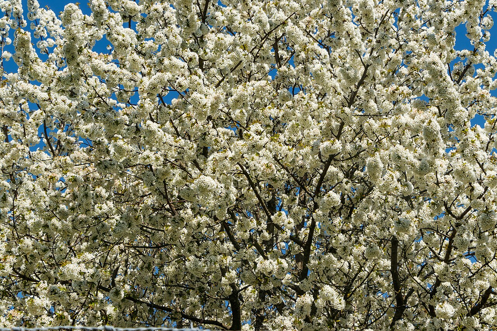
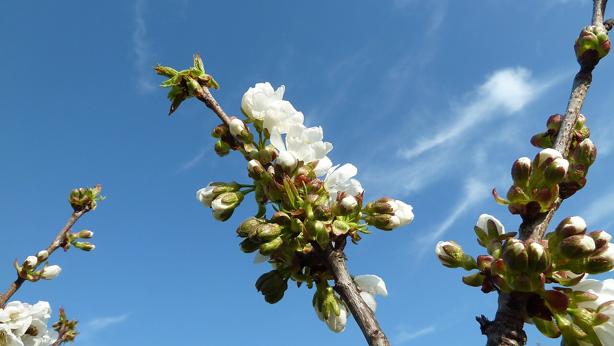

# 3 Wildkirsche (Prunus avium)

<figure class="img-right">
  
  <figcaption>Wildkirsche in voller Blüte — klein gehalten wird das Blütendach zum Schirm in Augenhöhe.</figcaption>
</figure>

## Steckbrief

- Natürliche Höhe: **15–25 m** — der ehrgeizigste Kandidat im Garten.
- Wuchs: kräftiger Mitteltrieb, ausgeprägte Apikaldominanz, schnellwüchsig in der Jugend.
- Schnittverträglichkeit: **eingeschränkt.** Kirschen verzeihen Fehler am schlechtesten von unseren vier Arten.

## Die goldene Regel: Nur im Sommer schneiden

Kirschen (wie alle *Prunus*) haben zwei Schwachstellen:

1. **Gummifluss:** Auf Wunden, besonders in der Saftruhe, reagiert die Kirsche mit Harz- und Gummiaustritt — geschwächtes Gewebe, Eintrittspforte für Krankheiten.
2. **Pilzinfektionen** (Bleiglanz, Monilia, Holzfäulepilze): Die Sporen fliegen vor allem in der feuchten, kühlen Jahreszeit; Winterwunden bleiben monatelang offen.

**Deshalb: Schnitt nur im Sommer, am besten Juli bis September** — direkt nach der Ernte, bei trockenem, warmem Wetter. Dann heilt die Wunde noch in derselben Saison am schnellsten, und der bremsende Sommerschnitt hilft gleich beim Kleinhalten. Das japanische Sprichwort „Wer Kirschen schneidet, ist ein Narr" zielt genau auf falsch gesetzte Winterschnitte. Sommerschnitt mit kleinen Wunden ist auch in Japan akzeptierte Praxis.

## Weitere Kirschen-Regeln

- **Kleine Wunden:** Möglichst nichts über 5 cm Durchmesser sägen. Lieber jährlich dünne Triebe ableiten, als alle paar Jahre dicke Äste opfern.
- **Scharfes, sauberes Werkzeug**, bei Krankheitsverdacht zwischen den Schnitten desinfizieren.
- **Maximal ~20 % Blattmasse** pro Jahr entfernen.
- Steiltriebe **früh** entfernen, solange sie bleistiftdünn sind — solche Schnitte bemerkt die Kirsche gar nicht.

## 4-Meter-Plan für die Wildkirsche

### Aufbau (falls noch jung)
1. Stamm auf ~2 m, darüber **4–5 flach stehende Leitäste** als Schirmgerüst auswählen.
2. Den Mitteltrieb, sobald er die Zielhöhe erreicht, im Sommer auf den obersten flachen Seitenast **ableiten**. Nie kappen — auf Kappung reagiert die Kirsche extrem mit Wasserschossern.
3. Junge Leitäste mit Schnur und Gewichten Richtung Waagerechte erziehen (Niwaki-Technik, → [Kapitel 02](02_japanische_schnittkunst.md)). Flache Äste wachsen langsamer und blühen besser — doppelter Gewinn.

### Jährliche Erhaltung (Juli–September nach der Ernte, ~30 min)
1. **Wasserschosser** (die steilen, langen Sommertriebe auf den Astoberseiten): alle ausreißen oder am Ansatz schneiden. Nach ein paar Jahren Routine sind das nur noch wenige.
2. Übersteher über der 4-m-Linie auf tiefere, flache Seitentriebe **ableiten**.
3. Nach innen wachsende und sich kreuzende Triebe raus.
4. Das Laubdach von unten „freilegen": hängende Triebe unter der gewünschten Schirmunterkante entfernen — so entsteht der schwebende Niwaki-Schirm.

### Was die Kirsche besonders schön macht

<figure class="img-left">
  
  <figcaption>Im April verwandelt sich der Schirm in ein Blütendach — die Sakura-Ästhetik im eigenen Garten.</figcaption>
</figure>

Waagerecht gezogene Etagen, ein freier Stamm — die glänzende Ringelborke ist eine Zierde! — und im April ein lockeres Blütendach: So wird die klein gehaltene Wildkirsche zum Prunkstück des Gartens, ganz nah an der japanischen *Sakura*-Ästhetik.

## Typische Fehler

- ❌ Winterschnitt, „weil da Zeit ist" → Gummifluss, Bleiglanz-Risiko.
- ❌ Kappen des Mitteltriebs → Besen aus 10 Steiltrieben im Folgejahr.
- ❌ Dicke Äste absägen → Fäulnis, die bei Kirschen schnell in den Stamm wandert.
- ❌ Zu selten schneiden: Die Kirsche legt pro Jahr locker 50–100 cm zu. Ein ausgelassenes Jahr ist okay, drei sind ein Problem.
