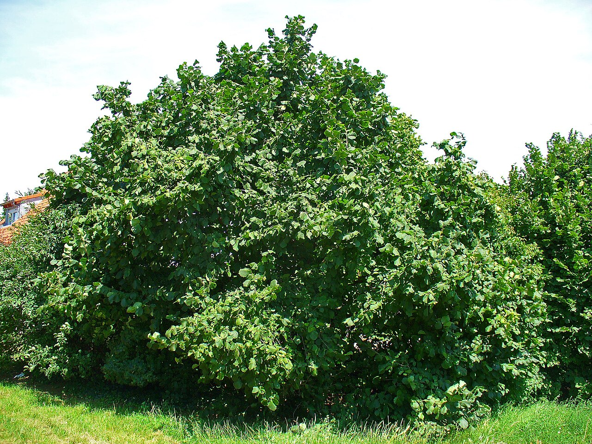
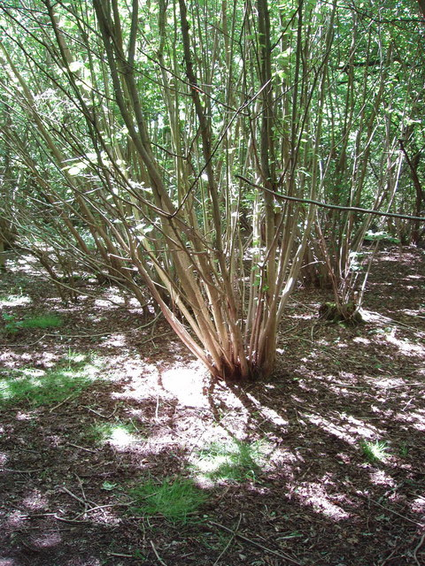
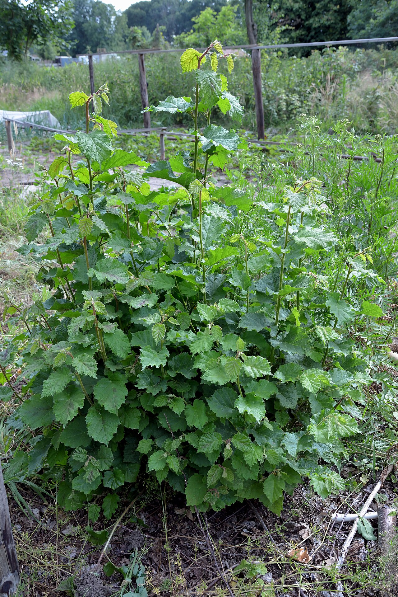

# 4 Hasel (Corylus avellana)

<figure class="hero">
  
  <figcaption>Die Hasel in Naturform: ein dichter Großstrauch — mit Stammauswahl wird daraus ein eleganter Schirm.</figcaption>
</figure>

## Steckbrief

- Natürliche Höhe: **5–7 m**, mehrstämmiger Großstrauch — von Natur aus schon fast im Zielbereich.
- Wuchs: treibt unermüdlich neue Ruten aus der Basis („Stockausschlag"), kein dominanter Mitteltrieb.
- Schnittverträglichkeit: **exzellent.** Die Hasel ist der gutmütigste Kandidat — hier kannst du fast nichts kaputt machen.

## Die Besonderheit: Die Hasel denkt von unten

Anders als Kirsche und Ahorn wächst die Hasel nicht als Baum mit Krone, sondern als ständig sich erneuernder Stämmebusch. Die Pflege besteht deshalb weniger aus Kronenschnitt und mehr aus **Stammmanagement**: Du wählst aus, welche Ruten bleiben dürfen, und entfernst den Rest an der Basis.

<figure class="img-left">
  
  <figcaption>Der Stämmefächer einer regelmäßig geschnittenen Hasel — aus diesem Vorrat wählst du die 5–7 schönsten.</figcaption>
</figure>

Das passt perfekt zur japanischen Schirm-Ästhetik: Eine Hasel mit **5–7 ausgewählten, leicht nach außen geneigten Stämmen** und einem freigestellten Blätterdach darüber sieht aus wie eine mehrstämmige *Zelkova* aus dem japanischen Garten — luftig, elegant, mit sichtbarem „Stämmefächer".

## 4-Meter-Plan für die Hasel

### Grundform herstellen (Winter, Okt–Feb)
1. **5–7 schöne, kräftige Stämme auswählen** — möglichst gleichmäßig im Kreis verteilt, leicht nach außen geneigt (ungerade Zahl, Asymmetrie: Niwaki-Prinzip).
2. **Alle anderen Ruten bodeneben absägen**, besonders alles Dünne, Steile, nach innen Wachsende im Zentrum. Das Zentrum soll offen und luftig sein.
3. Die gewählten Stämme bis auf ~1,5–2 m Höhe **aufasten** (Seitentriebe am Stamm entfernen) → der Stämmefächer wird sichtbar, das Dach beginnt darüber.
4. Stämme, die über 4 m wollen, auf einen flachen Seitenast **ableiten** (zur Rolle des Ableitens siehe unten).

### Hast du die Stämme eingekürzt? Dann jetzt die Kopftriebe auswählen

Wer die ausgewählten Stämme oben **gekappt** hat (z. B. auf 1 m eingekürzt), bekommt die typische Reaktion: viele junge Triebe — teils aus dem Boden, teils als Büschel am Schnittkopf. Beide behandelst du verschieden:

- **Bodentriebe:** konsequent raus, 1–2 schöne als Reserve stehen lassen (siehe „Rotierende Verjüngung"). Im Sommer lassen sie sich grün einfach mit der Hand **ausreißen** — das hält besser, als sie abzuschneiden.
- **Seitentriebe unten am Stamm** (im Bereich, der freier Stamm bleiben soll): **entfernen** → aufasten, Stämmefächer sichtbar machen.
- **Triebe oben am Schnittkopf:** **nicht alle wegnehmen!** Wähle pro Stamm die **1–2 (höchstens 3) kräftigsten, nach außen stehenden** aus — sie bilden das Blätterdach und ziehen die Höhe weiter. Den Rest am Kopf raus, sonst entsteht dort ein dichter Besen.

⚠️ **1 m ist niedrig fürs 4-m-Ziel.** Das Laubdach beginnt dann knapp über 1 m. Willst du höher hinaus, lass pro Stamm einen kräftigen, möglichst senkrechten Kopftrieb als **Verlängerung** weiterwachsen und kürze ihn erst kurz unter der Zielhöhe.

### Jährliche Erhaltung

<figure class="img-right">
  
  <figcaption>So sieht der jährliche Gegner aus: junge Bodentriebe — konsequent entfernen, sonst wird der Schirm zum Dickicht.</figcaption>
</figure>

- **Winter:** Neue Bodentriebe konsequent entfernen — das ist 80 % der Haselpflege! 1–2 besonders schöne Jungruten kannst du als „Nachwuchs" stehen lassen, um alle paar Jahre einen alten Stamm zu ersetzen.
- **Sommer (Juni):** Dach in Form bringen — Übersteher ableiten, das Laubdach von unten freistellen, Wolkenform modellieren (→ [Kapitel 02](02_japanische_schnittkunst.md)).

### Rotierende Verjüngung (der Hasel-Trick)
Die Hasel erlaubt, was bei der Kirsche undenkbar wäre: Du kannst **jedes Jahr den ältesten Stamm bodeneben entfernen** und durch eine nachgezogene Jungrute ersetzen. So erneuert sich der Strauch in ~6 Jahren komplett, ohne je seine Form zu verlieren. Das Prinzip entspricht der japanischen Daisugi-Logik: Regelmäßiger Rückschnitt auf denselben Punkt ist dauerhaft baumverträglich.

### Wie viel Ableiten braucht die Hasel?
Wenig. Bei Kirsche und Ahorn ist Ableiten die zentrale Höhensteuerung, weil sie einen dominanten Haupttrieb haben. Die Hasel hat keinen — ihre Höhe steuerst du über **Stammauswahl und Rotation** (zu hoher oder alter Stamm raus, junge Rute nachziehen), nicht übers Ableiten. **Ableiten brauchst du nur punktuell:** wenn ein einzelner Stamm über die Zielhöhe schießt und du ihn nicht gleich ganz opfern willst — dann auf einen tiefer sitzenden, nach außen zeigenden Seitentrieb zurücknehmen statt gerade abzuschneiden (sonst Besenwuchs am Schnitt).

**Notbremse:** Eine völlig verwahrloste Hasel kannst du komplett **auf den Stock setzen** — alles bodeneben ab. Erlaubt ist das nur zwischen 1. Oktober und 28. Februar (§ 39 BNatSchG). Sie treibt zuverlässig wieder aus, und du beginnst die Stammauswahl neu. Bis zum schönen Schirm dauert es dann 3–4 Jahre.

## Typische Fehler

- ❌ Oben rundherum abschneiden wie eine Hecke → dichter Besen, kein Schirmdach, und die Basis verkahlt trotzdem.
- ❌ Bodentriebe jahrelang stehen lassen → undurchdringliches Dickicht, die schönen Stämme verschwinden.
- ❌ Zu viele Stämme behalten — weniger ist mehr: 5 freigestellte Stämme wirken edler als 25 dünne Ruten.
