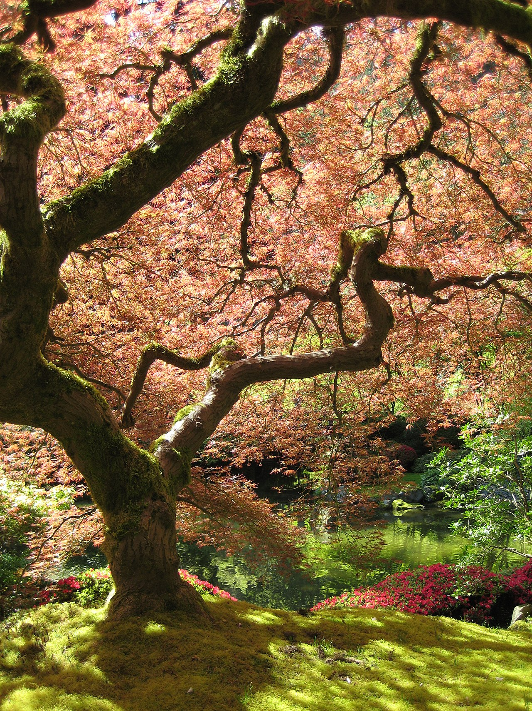

# 05 — Ahorn (Acer)

*Der berühmte Fächerahorn im Japanischen Garten von Portland: sichtbarer Stamm, fließende Etagen, lichtes Dach — das Vorbild für unseren Ahorn.*

## Steckbrief

- Natürliche Höhe: je nach Art **10–30 m** (Spitzahorn/Bergahorn) bzw. ~5–10 m (Feldahorn). *Welche Art im Garten steht, lohnt sich zu bestimmen — Feldahorn lässt sich deutlich leichter klein halten.*
- Wuchs: gegenständige Knospen (immer paarweise!), feine, dichte Verzweigung.
- Schnittverträglichkeit: **gut, aber mit zwei Eigenheiten:** Saftdruck im Spätwinter und empfindliche Rinde.

## Der Ahorn ist der Japan-Baum schlechthin

Der Fächerahorn (*Acer palmatum*, **Momiji**) ist neben der Kiefer der wichtigste Gestaltungsbaum japanischer Gärten. Alle Niwaki-Techniken aus [Kapitel 02](02_japanische_schnittkunst.md) wurden für den Ahorn entwickelt oder an ihm erprobt — sie funktionieren auch an unseren heimischen Arten:

- **Etagen aus feinen, waagerechten Astfächern**, dazwischen Luft.
- **Handarbeit statt Heckenschere:** Ahornblätter, die die Heckenschere durchtrennt, bekommen braune Ränder. Immer einzelne Triebe mit der Schere nehmen.
- **Transparenz als Ziel:** Ein gut geschnittener Ahorn ist so licht, dass die Sonne durch das Blätterdach fällt — das berühmte *Komorebi* (木漏れ日, „durch Blätter fallendes Licht").

## Die zwei Ahorn-Eigenheiten

### 1. Saftdruck — nicht im Spätwinter/Frühjahr schneiden
Ahorne entwickeln (wie Birken und Walnüsse) ab Februar einen starken Wurzeldruck: Schnittwunden „bluten" dann wochenlang. Das ist selten tödlich, schwächt aber und sieht schlimm aus.

**Schnittfenster für Ahorn:**
- **Hauptschnitt: Juni–August** — der Sommerschnitt bremst zugleich das Wachstum, perfekt für unser Ziel.
- Alternativ für Strukturschnitte: **September bis spätestens Dezember** (nach Laubfall, vor dem Saftanstieg).
- ❌ **Tabu: Februar–Mai.**

### 2. Gegenständige Knospen
Ahornknospen sitzen paarweise gegenüber. Kürzt du einen Trieb, treiben **beide** Knospen am Schnittpunkt aus → Gabelung („Zwiesel"). Japanische Gärtner nutzen das bewusst für die feine Fächerverzweigung — wo sie eine klare Linie wollen, entfernen sie aber **einen der beiden** Gabeltriebe. Merksatz: **Nach dem Schnitt kommt die Gabel — eine Zinke ziehst du.**

## 4-Meter-Plan für den Ahorn

### Aufbau
1. Entscheidung: **eintriebig mit Schirmkrone** (klassisch) oder **mehrstämmig** — sehr japanisch; Momiji werden oft so gezogen. Dann früh 2–3 Stämme festlegen.
2. Den Mitteltrieb bei Erreichen der Zielhöhe im Sommer auf einen flachen Seitenast **ableiten**.
3. **3–5 Leitäste in Etagen** anlegen, mit Schnur und Bambus in die Waagerechte erziehen. Ahornäste verholzen schnell — formiere nur junge, biegsame Triebe.

### Jährliche Erhaltung (Juni–August)
1. **Pinzieren:** Lange Neutriebe auf 2–4 Blattpaare einkürzen, bevor sie verholzen — die Hauptmethode, mit der Momiji in Japan fein und klein bleiben.
2. Steile, nach innen oder senkrecht wachsende Triebe ganz raus (*Eda-nuki*).
3. Übersteher über 4 m ableiten.
4. **Feinausputz von unten:** Alle nach unten hängenden Kleinsttriebe unter den Astfächern entfernen → die Etagen werden als klare „Schichten" lesbar.
5. Bei dichten Kronen: Innenraum auslichten, bis Lichtflecken auf den Boden fallen (*Komorebi*-Probe).

### Wundregel
Wie bei der Kirsche: möglichst keine Schnitte über ~5 cm. Ahornrinde ist dünn — stelle im Hochsommer nicht zu viel auf einmal frei, sonst bekommt der Stamm Sonnenbrand.

## Typische Fehler

- ❌ Schnitt im März/April → wochenlanges „Bluten".
- ❌ Heckenschere → braune Blattränder, struppige Oberfläche, Verlust der Etagenstruktur.
- ❌ Beide Gabeltriebe nach Schnitt stehen lassen → die Krone wird nach wenigen Jahren ein dichter Knäuel.
- ❌ Bei Spitz- und Bergahorn das Tempo unterschätzen: Die schieben in der Jugend über 1 m pro Jahr — der Juni-Durchgang ist hier Pflicht, nicht Kür.
