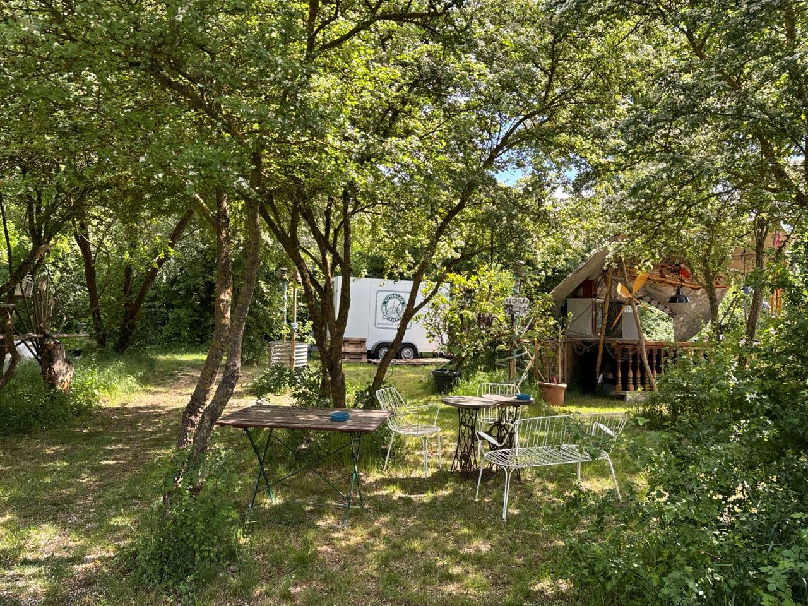
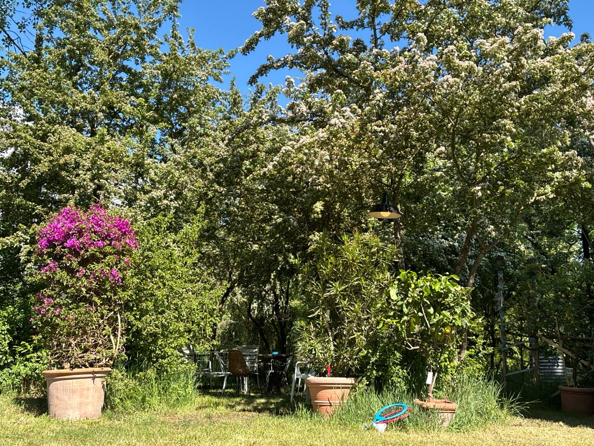
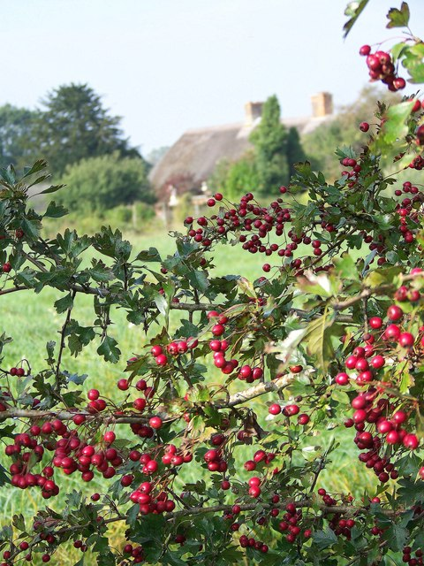
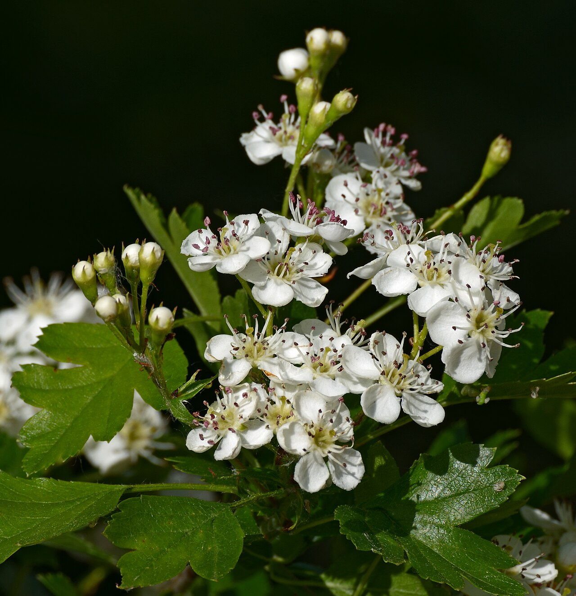

# 6 Weißdorn (Crataegus)

<figure class="hero">
  
  <figcaption>Genau das ist das Ziel: hochgeschulte Weißdorne mit freigestelltem Stamm und geschlossenem Laubdach bilden einen schattigen Sitzplatz — ein lebendes Dach in Augenhöhe.</figcaption>
</figure>

## Steckbrief

- Natürliche Höhe: **4–8 m** — der entspannteste Kandidat, oft von Natur aus nahe am Ziel.
- Wuchs: dicht, sparrig, bedornt; langsamer als Kirsche und Ahorn.
- Schnittverträglichkeit: **hervorragend.** Weißdorn ist ein klassisches Hecken- und Formschnittgehölz und verträgt auch starken Rückschnitt.

## Der ideale Formschnitt-Baum

<figure class="img-right">
  
  <figcaption>Dieselben Bäume im Mai: Die Blüte sitzt am mehrjährigen Holz, der freigestellte Stammbereich darunter bleibt offen.</figcaption>
</figure>

Der Weißdorn ist von unseren vier Arten der beste Kandidat für echte japanische Formarbeit. Was japanische Gärtner mit *Ilex crenata* (Japan-Stechpalme) als Wolkenbaum machen, gelingt mit Weißdorn genauso: dichtes, kleinblättriges Laub, das auf Schnitt mit feiner Verzweigung reagiert und geschnittene Formen sauber hält.

**Zwei Gestaltungswege:**

1. **Schirmdach (empfohlen fürs Blätterdach):** Stamm freistellen, oben ein flaches, dichtes Laubdach — wie ein grüner Pilz oder eine Dach-Platane, nur natürlicher in der Linie.
2. **Wolkenbaum (Tamamono):** 3–5 Hauptäste, an deren Enden du runde Laubkissen modellierst — der klassische „Cloud-Pruning"-Look.

## Besonderheiten

<figure class="img-left">
  
  <figcaption>Im Herbst trägt der Weißdorn leuchtend rote Beeren — Festmahl für Vögel, Schmuck für den Garten.</figcaption>
</figure>

- **Dornen:** Lange, harte Dornen — **dicke Handschuhe und Schutzbrille** sind beim Weißdorn keine Empfehlung, sondern Pflicht. Schnittgut nicht auf Wegen liegen lassen, die man barfuß betritt.
- **Blüte am mehrjährigen Holz:** Die weiße Mai-Blüte und die roten Beeren für die Vögel erscheinen am älteren, mehrjährigen Holz — nicht am frischen Austrieb. Deshalb blüht der Weißdorn trotz Schnitt weiter. Wer im Sommer **nach der Blüte** schneidet, opfert wenig. Wer im Winter stark in altes Holz schneidet, verliert an den geschnittenen Partien die kommende Blüte. → Haupt-Formschnitt **im Juni, direkt nach der Blüte**.
- **Feuerbrand:** Weißdorn ist Wirtspflanze für Feuerbrand (*Erwinia amylovora*) und überträgt ihn auf Apfel und Birne — pflanze ihn deshalb **nicht direkt neben Obstgehölze**. Symptome: plötzlich welkende, **wie verbrannt schwarzbraune Triebspitzen, oft hakenförmig gekrümmt**. Dann: befallene Partien großzügig entfernen (30–50 cm ins gesunde Holz), Werkzeug desinfizieren, Schnittgut in den Restmüll — nicht auf den Kompost. Feuerbrand ist je nach Bundesland meldepflichtig.
- **Vogelschutz:** Weißdorn ist ein Lieblings-Nistplatz, dornengeschützt! Prüfe vor jedem Schnitt zwischen März und September gründlich auf besetzte Nester — im Zweifel verschiebst du den Schnitt.

## 4-Meter-Plan für den Weißdorn

### Aufbau
1. Form wählen (Schirm oder Wolken, s. o.).
2. Stamm bzw. Stämme bis zur gewünschten Höhe aufasten — Achtung, langsam vorgehen: Weißdorn-Stämme mit ihrer rauen, geriffelten Borke sind eine Zierde, aber alte Aststummel heilen langsam.
3. Gerüstäste auswählen; beim Weißdorn dürfen es ruhig knorrig-bizarre sein — genau das gibt den gealterten Niwaki-Charakter.

### Jährliche Erhaltung

<figure class="img-right">
  
  <figcaption>Die weiße Blüte im Mai ist das Startsignal: Sobald sie verblüht ist, kommt im Juni der Hauptformschnitt.</figcaption>
</figure>

- **Juni (nach der Blüte): Hauptformschnitt.** Der Weißdorn verträgt als einziger unserer vier auch die **Handheckenschere** für die Feinform der Laubpolster — die kleinen Blätter verzeihen es. Wer es ganz sauber will, schneidet trotzdem mit der Bypass-Schere Trieb für Trieb.
- **August: leichter Korrekturdurchgang** für die Nachtriebe.
- **Winter (bei Bedarf):** Strukturkorrekturen, ganze Störäste raus. Das verträgt der Weißdorn problemlos — nur eben mit Blütenverlust an den betroffenen Partien.
- Höhe: Übersteher wie immer **ableiten** statt kappen. Der Weißdorn würde Kappung verzeihen, aber Ableiten sieht besser aus.

### Geduld zahlt sich aus
Weißdorn wächst gemächlich (20–40 cm/Jahr). Das macht ihn pflegeleicht: Einmal in Form, hält er sie mit ein bis zwei kurzen Durchgängen pro Jahr fast von selbst. Dafür dauert der Aufbau einer Wolkenform 4–6 Jahre — typisch japanisch: Der Weg ist das Ziel.

## Typische Fehler

- ❌ Ohne Handschuhe und Brille arbeiten — Weißdorn-Dornen verursachen ernsthafte Stichverletzungen, die sich gern entzünden.
- ❌ Winterschnitt der gesamten Oberfläche → eine Saison ohne Blüte und Beeren.
- ❌ Feuerbrand-Triebe übersehen oder kompostieren.
- ❌ Brutzeit ignorieren — gerade im Weißdorn brütet fast immer jemand.
