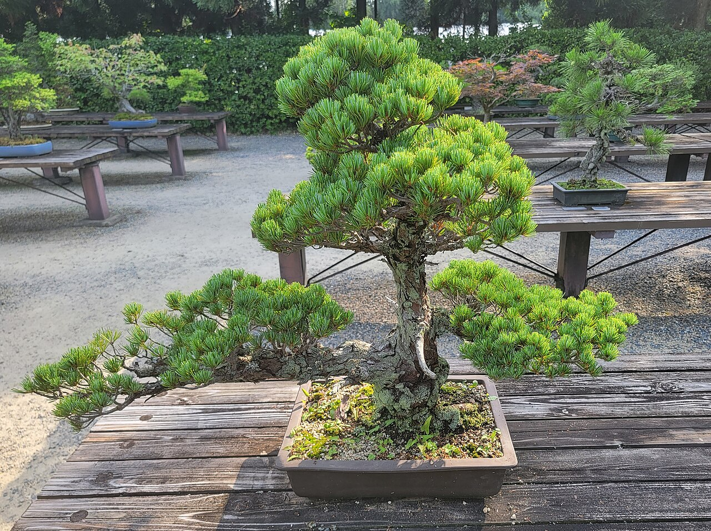
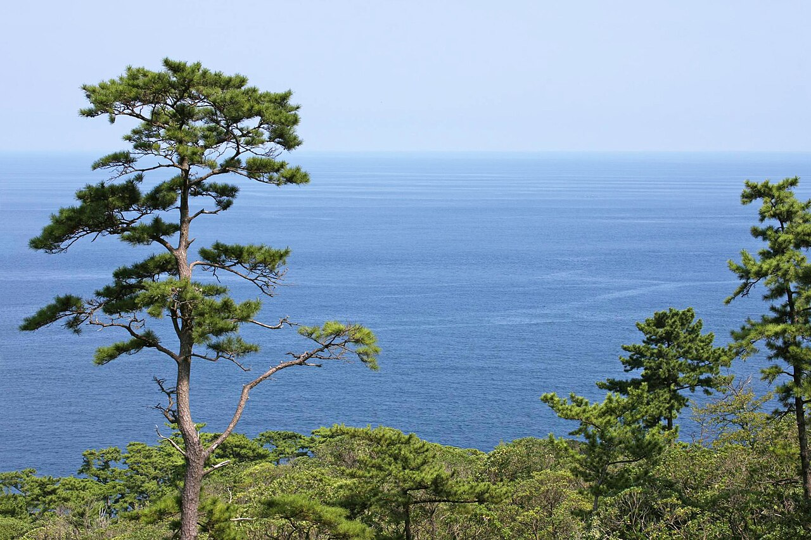
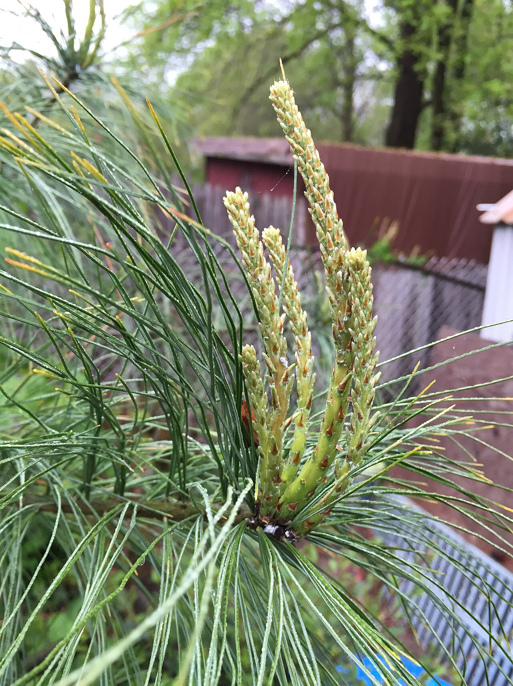

# 7 Kiefer (Pinus)

<figure class="hero">
  
  <figcaption>Die Zielstruktur in Reinform: klar getrennte Laubpolster (Etagen) über sichtbarem Stamm. Hier als Bonsai gezeigt — am Gartenbaum gilt dasselbe Prinzip, nur größer.</figcaption>
</figure>

## Steckbrief

- Natürliche Höhe: je nach Art **5–40 m** (Bergkiefer klein, Wald- und Schwarzkiefer groß). Für 4 m eignen sich besonders **Schwarzkiefer** (*Pinus thunbergii*/*nigra*), **Wald­kiefer** (*P. sylvestris*) und die kompakte **Berg­kiefer** (*P. mugo*).
- Wuchs: immergrün, deutlicher Haupttrieb, Austrieb in **„Kerzen"** (gestauchte Frühjahrs­triebe), die sich strecken und benadeln.
- Schnittverträglichkeit: **gut bei der richtigen Technik** — aber Kiefern schneidet man **anders** als Laubbäume (siehe unten). Wer sie wie einen Apfelbaum behandelt, ruiniert sie.

## Die Kiefer ist *der* Niwaki-Baum

Neben dem Ahorn ist die Kiefer (**Matsu**, 松) die wichtigste Gestalt der japanischen Gartenkunst — und das Vorbild, an dem fast alle Niwaki-Techniken aus [Kapitel 2](02_japanische_schnittkunst.md) entwickelt wurden: Etagenform (*dan-zukuri*), Laubpolster („Wolken"), waagerecht erzogene Äste, gealterter Habitus.

<figure class="img-left">
  
  <figcaption>Auch der Wind formt Kiefern zu lockeren Etagen über freiem Stamm — dieses gealterte Vorbild ahmt die Niwaki-Kunst nach.</figcaption>
</figure>

Der entscheidende Unterschied zu deinen anderen Bäumen: Die Kiefer wird **nicht gesägt und nicht abgeleitet**, sondern fast ausschließlich über **Kerzen** und **Nadeln** in Form und Größe gehalten. Sie verzweigt sich auch nicht beliebig nach — aus altem, nadellosem Holz treibt sie **kaum wieder aus**. Deshalb gilt die eiserne Regel: **nie ins kahle Holz zurückschneiden.** Wer einen Kiefernast hinter der grünen Benadelung kappt, bekommt dort nie wieder einen Trieb — der Ast ist tot.

## Von Setzlingen an aufbauen

Genau der richtige Weg: Eine Kiefer von klein auf zu erziehen ist viel dankbarer, als später eine große umzuformen. Plane in Ruhe — bis zur fertigen 4-m-Etagenkiefer vergehen gut und gern **10–20 Jahre**. Das ist kein Makel, sondern Niwaki: der Weg ist das Ziel.

### Jahre 1–3: wachsen lassen und Stamm wählen
- Setzling kräftig wachsen lassen, **noch nicht formieren**. Erst muss Wurzel und Stamm Substanz bekommen.
- Den geradesten, kräftigsten Trieb als **Stamm** bestimmen; offensichtliche Konkurrenz-Doppelspitzen entfernen.
- Wer mag, legt früh eine leichte **Bewegung in den Stamm** (Niwaki liebt den geschwungenen Stamm): jungen, noch biegsamen Stamm vorsichtig mit breitem Band an einen Pfahl in sanfte Kurven ziehen.

### Jahre 3–8: Etagen anlegen
- **3–5 Hauptäste** als Etagen auswählen — in klar getrennten Höhen, möglichst waagerecht, nach außen gerichtet, asymmetrisch verteilt (ungerade Zahl, Niwaki-Prinzip).
- Diese Äste mit **breitem Band, Schnur oder Bambus** in die Waagerechte ziehen, solange sie jung und biegsam sind (verholzte Kiefernäste lassen sich nicht mehr umerziehen).
- Alles, was **senkrecht nach oben oder steil nach innen** wächst und keine Etage werden soll, am Ansatz entfernen.
- Den Stamm zwischen den Etagen **freistellen** (Aufasten), damit die typische „schwebende" Etagenstruktur entsteht.

### Ab ~4 m: Deckel und Erhalt
- Den Leittrieb auf Zielhöhe stoppen (siehe Kerzenschnitt) und die oberste Etage zum flachen Schirm ausformen.
- Ab jetzt nur noch der jährliche Kerzen- und Nadel­durchgang — die Höhe steht.

## Die zwei Kiefern-Techniken

<figure class="img-right">
  
  <figcaption>Die „Kerzen": gestauchte Frühjahrstriebe, bevor die Nadeln sich öffnen. Hier setzt der Kerzenschnitt an.</figcaption>
</figure>

### 1. Kerzenschnitt (Midori-tsumi) — Mai/Juni
Im Frühjahr schiebt die Kiefer ihre neuen Triebe als „Kerzen". Solange sie **weich** sind und die Nadeln sich noch nicht geöffnet haben, bestimmst du mit den **Fingern** (nicht der Schere — Metall bräunt die Schnittstellen) das Wachstum:
- Kerze **ganz ausbrechen** → kein Längenwachstum an dieser Stelle, die Kiefer bleibt kompakt.
- Kerze **zur Hälfte oder zu einem Drittel abknipsen** → gebremstes, dichteres Wachstum.
- Kerze **stehen lassen** → volle Verlängerung, dort wo du Höhe oder einen längeren Ast brauchst.

So steuerst du Größe und Dichte Trieb für Trieb — **das ist die Hauptmethode**, mit der eine Kiefer auf 4 m gehalten und gleichzeitig fein verzweigt wird. An starkwüchsigen Schwarz- und Waldkiefern entfernt man kräftige Kerzen oft **ganz** und lässt die schwächeren Zweittriebe austreiben (Technik *mekiri*) — das ergibt kürzere Nadeln und kompaktere Polster.

### 2. Nadeln zupfen (Momiage) — Herbst (Okt/Nov)
Im Herbst zupfst du an den Polstern die **alten Nadeln** (die vom Vorjahr) und einen Teil der überzähligen heurigen Nadeln aus — von Hand, gegen die Wuchsrichtung.
- Das lässt **Licht und Luft** in die Etagen, sodass sie nicht von innen verkahlen.
- Es **bremst** den Baum (weniger Nadelmasse = weniger Energie) — willkommen fürs Kleinhalten.
- Faustregel: an starken Trieben mehr ausdünnen, an schwachen weniger — so gleichst du den Wuchs aus.

## Was die Kiefer NICHT verzeiht

- ❌ **Schnitt ins kahle Holz** hinter der Benadelung — treibt nie wieder aus, der Ast stirbt.
- ❌ **Schere an den Kerzen** — bräunt die Schnittstellen; immer mit den Fingern.
- ❌ **Heckenschere über die Polster** — durchschnittene Nadeln werden braun und struppig.
- ❌ **Ableiten/Sägen wie beim Laubbaum** — funktioniert bei der Kiefer kaum, weil sie aus altem Holz nicht nachtreibt. Form kommt über Kerzen, nicht über die Säge.
- ❌ **Alle Kerzen gleich behandeln** — dann wächst der Baum unausgewogen; starke stärker bremsen als schwache.

## Auf einen Blick

| Wann | Was |
|---|---|
| **Mai/Juni** | Kerzenschnitt (Midori-tsumi): Kerzen mit den Fingern ausbrechen oder kürzen |
| **Sommer** | Junge Etagenäste mit Band/Bambus in die Waagerechte ziehen, Bindungen prüfen |
| **Okt/Nov** | Nadeln zupfen (Momiage): alte Nadeln raus, Polster auslichten |
| **Ganzjährig** | Steiltriebe und Doppelspitzen am Stamm entfernen — aber nie ins kahle Holz |
