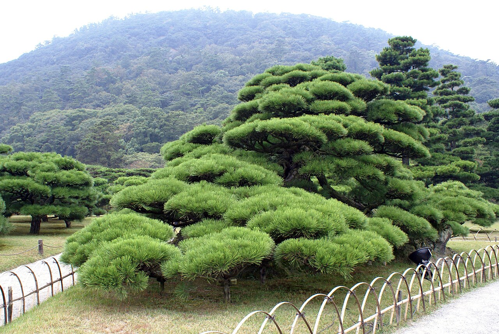

# Bäumchenschnitt 🌳

**Ratgeber: Bäume dauerhaft auf ~4 m Höhe halten und ein schönes Blätterdach formen — inspiriert von der japanischen Schnittkunst (Niwaki).**

*Niwaki in Vollendung: geformte Kiefern im Ritsurin-Garten, Takamatsu (Japan)*

## Worum es geht

Im Garten stehen Wildkirschen, Haseln, Ahorn und ein Weißdorn. Alle vier wollen von Natur aus deutlich höher als 4 m werden. Dieser Ratgeber zeigt, wie du sie mit regelmäßigem, durchdachtem Schnitt klein hältst — und zwar so, dass sie nicht wie verstümmelte Straßenbäume aussehen, sondern wie bewusst geformte Gartenbäume mit luftigem, schirmförmigem Blätterdach.

## Die Kapitel

| Datei | Inhalt |
|---|---|
| [01 — Grundprinzipien](01_grundprinzipien.md) | Wie Bäume auf Schnitt reagieren, Werkzeug, Schnitttechnik, die 4-Meter-Strategie |
| [02 — Japanische Schnittkunst (Niwaki)](02_japanische_schnittkunst.md) | Niwaki-Philosophie, Etagenform, Kopfschnitt-Tradition, konkrete Techniken |
| [03 — Wildkirsche](03_wildkirsche.md) | Der heikelste Kandidat: Schnittzeitpunkt im Sommer, kleine Wunden |
| [04 — Hasel](04_hasel.md) | Der gutmütigste: Auslichten, auf den Stock setzen, Schirmform |
| [05 — Ahorn](05_ahorn.md) | Momiji-Vorbild aus Japan, Saftdruck beachten, feiner Schnitt |
| [06 — Weißdorn](06_weissdorn.md) | Extrem schnittverträglich, Dachform, Blüte erhalten |
| [07 — Jahreskalender](07_jahreskalender.md) | Wann welcher Baum drankommt — Übersicht fürs ganze Jahr |

## Die Kurzfassung (für Eilige)

1. **Klein halten geht nur mit Regelmäßigkeit.** Einmal radikal kappen erzeugt hässlichen Besenwuchs. Jedes Jahr (oder zweimal jährlich) wenig schneiden — das ist der japanische Weg.
2. **Auf Verzweigung ableiten statt absägen.** Nie mitten im Ast kappen, sondern immer auf einen schwächeren, nach außen zeigenden Seitenast zurückschneiden („Ableiten"). So bleibt die natürliche Silhouette erhalten.
3. **Das Blätterdach entsteht durch Etagen.** Wenige, gut platzierte Leitäste waagerecht ziehen, alles Steile und nach innen Wachsende entfernen — das ist der Kern von Niwaki.
4. **Sommerschnitt bremst, Winterschnitt treibt.** Wer Bäume klein halten will, schneidet vor allem im Sommer (Juni–August). Die Kirsche **nur** dann.
5. **Rechtlicher Rahmen:** Radikale Schnitte (auf den Stock setzen, starker Rückschnitt) sind in Deutschland nur **1. Oktober – 28. Februar** erlaubt (§ 39 BNatSchG). Form- und Pflegeschnitte sind ganzjährig zulässig — aber vorher immer auf Nester prüfen.

## Status

- [x] Ratgeber-Grundgerüst
- [x] Bilder (Wikimedia Commons, frei lizenziert)
- [ ] Fotos der eigenen Bäume ergänzen (Vorher/Nachher)

## Bildnachweis

Alle Bilder stammen von [Wikimedia Commons](https://commons.wikimedia.org) und stehen unter freien Lizenzen:

| Bild | Autor·in | Lizenz | Quelle |
|---|---|---|---|
| niwaki_ritsurin.jpg | 663highland | CC BY 2.5 | [Commons](https://commons.wikimedia.org/wiki/File:Ritsurin_park05s3200.jpg) |
| kiefer_niwaki_tokyo.jpg | Jetoney | gemeinfrei | [Commons](https://commons.wikimedia.org/wiki/File:Japanese_Black_Pine,_National_Garden,_Tokyo.jpg) |
| karikomi_okayama.jpg | Paolo | CC BY-SA 4.0 | [Commons](https://commons.wikimedia.org/wiki/File:Karikomi_Okayama_jardin.jpg) |
| wolkenschnitt_eibe.jpg | pam fray | CC BY-SA 2.0 | [Commons](https://commons.wikimedia.org/wiki/File:Cloud_pruning_of_yew_hedges,_Doddington_Place_Gardens_-_geograph.org.uk_-_6855489.jpg) |
| daisugi_kibune.jpg | Indiana jo | CC BY-SA 4.0 | [Commons](https://commons.wikimedia.org/wiki/File:New_breed_Dai_Sugi_02.jpg) |
| schnitt_astring.jpg | Mokkie | CC BY-SA 3.0 | [Commons](https://commons.wikimedia.org/wiki/File:Branch_collar.jpg) |
| wildkirsche_baum.jpg | H. Zell | CC BY-SA 3.0 | [Commons](https://commons.wikimedia.org/wiki/File:Prunus_avium_-_Hohenwettersbach_01.jpg) |
| wildkirsche_bluete.jpg | Thomas Schilling | CC BY-SA 4.0 | [Commons](https://commons.wikimedia.org/wiki/File:P1020626_Prunus_avium_blossoms.jpg) |
| hasel_habitus.jpg | H. Zell | CC BY-SA 3.0 | [Commons](https://commons.wikimedia.org/wiki/File:Corylus_avellana_0001.JPG) |
| hasel_stockausschlag.jpg | David Hawgood | CC BY-SA 2.0 | [Commons](https://commons.wikimedia.org/wiki/File:Coppiced_hazel_in_Piddington_Wood_-_geograph.org.uk_-_182545.jpg) |
| wasserschosser_hasel.jpg | Rasbak | CC BY-SA 3.0 | [Commons](https://commons.wikimedia.org/wiki/File:Corylus_avellana_water_sprouts_(01).jpg) |
| ahorn_portland.jpg | Jeremy Reding | CC BY-SA 2.0 | [Commons](https://commons.wikimedia.org/wiki/File:Portland_Japanese_Garden_maple.jpg) |
| weissdorn_bluete.jpg | Ввласенко | CC BY-SA 3.0 | [Commons](https://commons.wikimedia.org/wiki/File:Blooming_hawthorn_(Crataegus_monogyna).jpg) |
| weissdorn_baum.jpg | Trish Steel | CC BY-SA 2.0 | [Commons](https://commons.wikimedia.org/wiki/File:Hawthorn_(Crataegus_monogyna),_Bishopstone_-_geograph.org.uk_-_976441.jpg) |
