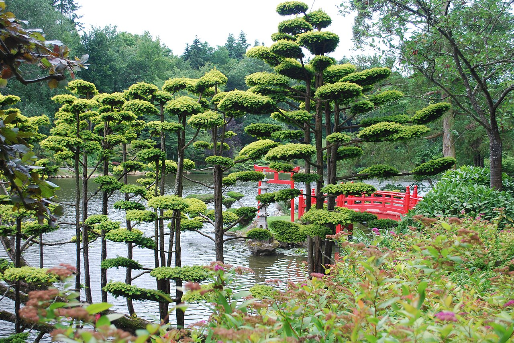

# Bäumchenschnitt 🌳

**Ratgeber: Bäume dauerhaft auf ~4 m Höhe halten und ein schönes Blätterdach formen — inspiriert von der japanischen Schnittkunst (Niwaki).**

<figure class="hero">
  
  <figcaption>So sieht das Ziel aus: über Jahre wolkengeschnittene Bäume — sichtbare Stämme, klar getrennte Laub­etagen, ein luftiges Dach (Parc Oriental de Maulévrier, Frankreich).</figcaption>
</figure>

## Worum es geht

Im Garten stehen Wildkirschen, Haseln, Ahorn und ein Weißdorn. Alle vier wollen von Natur aus deutlich höher als 4 m werden. Dieser Ratgeber zeigt, wie du sie mit regelmäßigem, durchdachtem Schnitt klein hältst — und zwar so, dass sie nicht wie verstümmelte Straßenbäume aussehen, sondern wie bewusst geformte Gartenbäume mit luftigem, schirmförmigem Blätterdach.

## Die Kapitel

| Datei | Inhalt |
|---|---|
| [1 Grundprinzipien](01_grundprinzipien.md) | Wie Bäume auf Schnitt reagieren, Werkzeug, Schnitttechnik, die 4-Meter-Strategie |
| [2 Japanische Schnittkunst (Niwaki)](02_japanische_schnittkunst.md) | Niwaki-Philosophie, Etagenform, Kopfschnitt-Tradition, konkrete Techniken |
| [3 Wildkirsche](03_wildkirsche.md) | Der heikelste Kandidat: Schnittzeitpunkt im Sommer, kleine Wunden |
| [4 Hasel](04_hasel.md) | Der gutmütigste: Auslichten, auf den Stock setzen, Schirmform |
| [5 Ahorn](05_ahorn.md) | Momiji-Vorbild aus Japan, Saftdruck beachten, feiner Schnitt |
| [6 Weißdorn](06_weissdorn.md) | Extrem schnittverträglich, Dachform, Blüte erhalten |
| [7 Jahreskalender](07_jahreskalender.md) | Wann welcher Baum drankommt — Übersicht fürs ganze Jahr |
| [Quellen](08_quellen.md) | Fachliche Belege, Niwaki-Literatur und Bildnachweis |

## Die Kurzfassung (für Eilige)

1. **Klein halten geht nur mit Regelmäßigkeit.** Einmal radikal kappen erzeugt hässlichen Besenwuchs. Jedes Jahr (oder zweimal jährlich) wenig schneiden — das ist der japanische Weg.
2. **Auf Verzweigung ableiten statt absägen.** Nie mitten im Ast kappen, sondern immer auf einen schwächeren, nach außen zeigenden Seitenast zurückschneiden („Ableiten"). So bleibt die natürliche Silhouette erhalten.
3. **Das Blätterdach entsteht durch Etagen.** Wenige, gut platzierte Leitäste waagerecht ziehen, alles Steile und nach innen Wachsende entfernen — das ist der Kern von Niwaki.
4. **Sommerschnitt bremst, Winterschnitt treibt.** Wer Bäume klein halten will, schneidet vor allem im Sommer (Juni–August). Die Kirsche **nur** dann.
5. **Rechtlicher Rahmen:** Radikale Schnitte (auf den Stock setzen, starker Rückschnitt) sind in Deutschland nur **1. Oktober – 28. Februar** erlaubt (§ 39 BNatSchG). Form- und Pflegeschnitte sind ganzjährig zulässig — aber vorher immer auf Nester prüfen.

